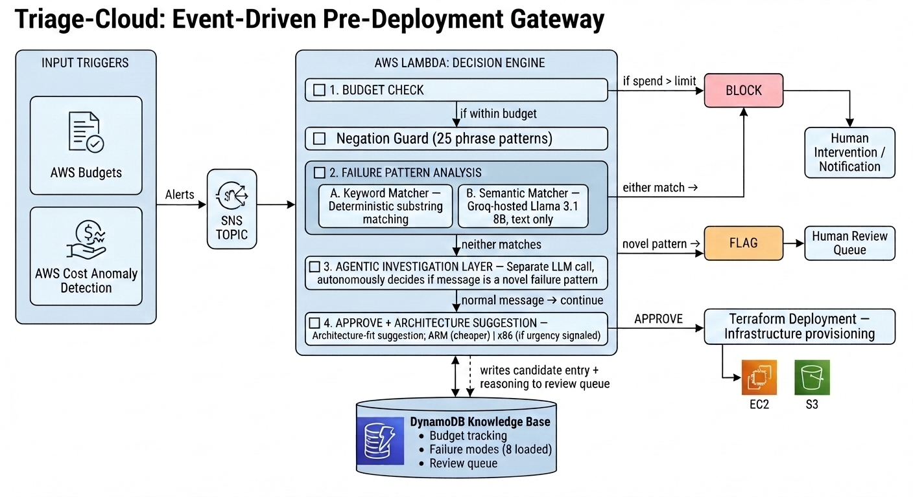

# Triage-Cloud

**Event-Driven, Agentic Pre-Deployment Gateway for Cloud Provisioning**

Triage-Cloud is an event-driven framework that evaluates cost, failure risk, and architecture fit — together, as a pre-deployment gate — before infrastructure is provisioned. Instead of the usual reactive FinOps pattern (alert after money is already spent), Triage-Cloud sits in front of your Terraform deployment and produces one of three gated outcomes: **APPROVE**, **FLAG**, or **BLOCK**.

---

## Why

Most cloud cost tooling today is reactive:

- AWS Budgets and Cost Anomaly Detection tell you **after** you've overspent.
- Deployment failure patterns (quota exhaustion, IAM misconfig, etc.) are rarely checked against historical incident data **before** a new deployment is attempted.
- Architecture choices (e.g., instance family) are usually made by default, not by measured workload fit.

Triage-Cloud closes that gap by gating deployment itself — not just reporting on it afterward.

---

The **Decision Engine** (a single AWS Lambda) runs five checks in sequence:

| # | Check | Outcome |
|---|-------|---------|
| 1 | **Budget check** | If spend exceeds the limit → `BLOCK` |
| 2 | **Negation guard** (25 phrase patterns) | Skips keyword check on resolved/negated language |
| 3 | **Failure-pattern analysis** — deterministic keyword matcher **+** LLM semantic matcher (Groq-hosted Llama 3.1 8B) | Either match → `BLOCK` |
| 4 | **Agentic investigation layer** — a separate LLM call autonomously decides if an unmatched message is a novel failure pattern | Novel pattern → `FLAG` (written to human review queue) |
| 5 | **Approve + architecture suggestion** | `APPROVE`, with ARM (cheaper, default) or x86 (if urgency signaled) |

A match at step 3 blocks and notifies for human intervention. A `FLAG` at step 4 writes a candidate entry — with the model's own reasoning — to a DynamoDB review queue instead of silently approving or blocking.

---

## Key Features

- **Three-way decision output** (`APPROVE` / `FLAG` / `BLOCK`) instead of a binary allow/deny gate.
- **Dual failure-pattern matching** — deterministic substring matching backed by an LLM semantic layer, so brittle keyword-only matching isn't the only line of defense.
- **Agentic escalation** — unmatched messages aren't blindly approved; an autonomous agent decides whether they represent a new failure pattern worth a human's attention.
- **Architecture-fit recommendation** — informed by an empirical Monte Carlo CPU benchmark (ARM vs. x86), not a blanket default.
- **Event-driven, serverless** — AWS Budgets / Cost Anomaly Detection → SNS → Lambda → Terraform, with DynamoDB as the knowledge base.
- **Extensively evaluated, not just demoed** — 20 hand-crafted scenarios, a 580-case large-scale evaluation, a prompt-style ablation study, ROC/AUC analysis, chaos/robustness testing, a 39-test unit suite, cost-per-invocation analysis, and a TF-IDF baseline comparison. See [Evaluation](#evaluation) below.

---

## Tech Stack

- **AWS Lambda** — decision engine
- **AWS SNS** — event bus for Budgets / Cost Anomaly Detection alerts
- **Amazon DynamoDB** — knowledge base (budget tracking, failure modes, review queue)
- **Groq (Llama 3.1 8B)** — LLM-hosted semantic failure-matching and agentic investigation layer
- **Terraform** — infrastructure enforcement (EC2, S3)

---

## How It Compares

| System | Pre-deploy gate | Cost signal | Failure-risk signal | Arch-fit signal | Escalates uncertain cases |
|---|---|---|---|---|---|
| FinOps automation tools | No | Yes | No | No | N/A |
| AWS FinOps Agent | No | Yes | No | No | Yes (all actions) |
| Cost-aware provisioning | Partial | Yes | No | Partial | No |
| Policy-as-code (Sentinel/OPA) | Yes | Partial | No | No | No |
| Static IaC scanners (Checkov, tfsec) | Yes | No | No | No | No |
| Infracost | Yes* | Yes | No | No | No |
| **Triage-Cloud** | **Yes** | **Yes** | **Yes** | **Yes** | **Yes (FLAG)** |

\*Only when explicitly configured as a blocking check.

No existing tool combines pre-deployment gating with live budget state, historical failure-pattern matching (deterministic **and** semantic), and an architecture-fit recommendation in a single automated decision — that's the specific gap Triage-Cloud targets.

---

## Evaluation

**Initial evaluation** — 20 hand-crafted scenarios: 100% accuracy after fixing 7 real defects surfaced during testing.

**Large-scale evaluation** — 580 real invocations of the live system (100 hand-crafted + 480 template-generated):

| Category | Accuracy |
|---|---|
| Overall (before fix) | 62.4% |
| Hand-crafted subset | 92.0% |
| Template-generated subset | 56.2% |

This revealed a real **generalization gap**: the system performed near-perfectly on hand-crafted phrasing but dropped to near-chance on systematically varied sentence structures.

**After two targeted fixes** (negation guard expanded 12→25 patterns, few-shot prompting added):

| Metric | Before | After | Δ |
|---|---|---|---|
| Overall accuracy | 62.4% | 73.4% | +11.0 |
| Template-gen. accuracy | 56.2% | 70.2% | +14.0 |
| Keyword-only baseline | 60.2% | 71.0% | +10.8 |

Other results reported honestly, including remaining limitations:

- **ROC/AUC** of the semantic layer's confidence score: AUC = 0.67 (vs. 0.5 random baseline).
- **Prompt ablation** (3 styles, 216 real model calls): the simplest baseline prompt outperformed role-based and chain-of-thought prompting on every measure.
- **Chaos/robustness testing**: 5 malformed inputs, no crashes; found and fixed one real validation defect.
- **Full unit test suite**: 39 tests covering every function, including end-to-end integration tests.
- **Cost per invocation**: ~$0.000002 without semantic check, ~$0.0000034 with it — both well within AWS free tier.
- **TF-IDF baseline comparison**: classical lexical similarity (AUC 0.599) underperforms the LLM semantic layer (AUC 0.670) across every data slice.

The paper is explicit that even after fixes, template-generated accuracy (70.2%) still falls short of hand-crafted accuracy, and the semantic layer's marginal advantage over keyword-only matching narrows at scale (2.4 points vs. 10 points on the smaller set). Full details, figures, and discussion are in the paper.

---

## Failure Modes Tracked

Fifteen failure modes were documented; eight are currently loaded into the operational knowledge base:

- IAM misconfiguration
- Resource quota exhaustion
- Free tier hour depletion
- Security group misconfiguration
- CloudFormation stack failure
- Disk space exhaustion
- API throttling
- S3 permission issue

---

## Limitations

- All evaluation uses hand-crafted or systematically template-generated synthetic messages, not production traffic.
- The knowledge base reflects one practitioner's incident history and public documentation.
- The decision-priority weighting (AHP: 61.9% failure-risk, 28.4% cost, 9.6% architecture-fit) reflects the author's own judgment, not a multi-stakeholder study.
- The semantic layer's confidence score is coarse (four discrete levels), limiting ROC/AUC precision.
- The TF-IDF baseline is classical, not a dense embedding method (no hosted embedding API was available at comparison time).
